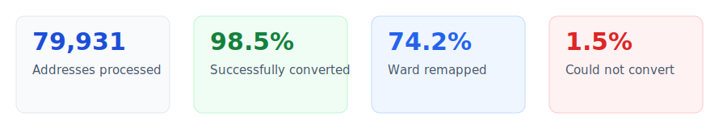
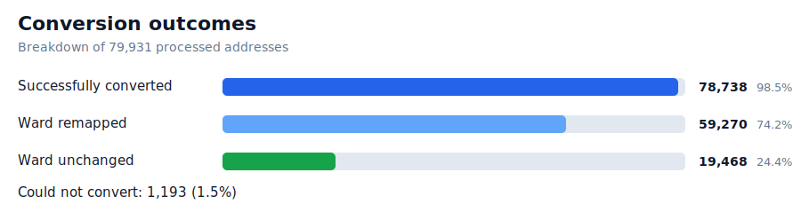
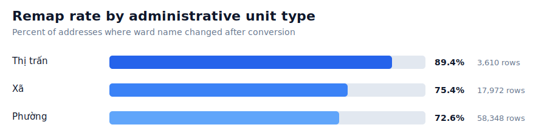
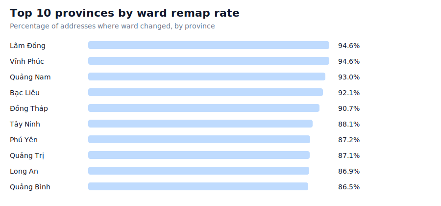
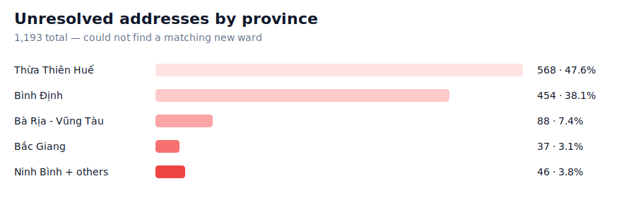

# Vietnam Administrative Address Converter

Convert Vietnamese administrative addresses between the old structure (`province / district / ward`) and the new structure (`province / ward`) following the 2025 administrative merger.

[](https://www.python.org)
[](https://huggingface.co/datasets/trucmtnguyen/vietnam-address-collection)
[](https://github.com/trng28/address-converter/actions/workflows/ci.yml)

---

## What it does

- Vietnam's 2025 administrative reform removed the district level nationwide and merged or renamed many wards.
- This tool parses free-form addresses in the old format and maps them to the new administrative structure.
- It supports both single-address conversion and batch CSV normalization.

---

## Installation

```bash
python -m venv .venv

# macOS / Linux
source .venv/bin/activate

# Windows PowerShell
.\.venv\Scripts\Activate.ps1

pip install -r requirements.txt
```

---

## Usage

### Single address

```bash
python main.py --address "Đường Trần Não, Phường Thảo Điền, TP Thủ Đức, Thành phố Hồ Chí Minh"
```

### Batch CSV

Download the dataset:

```bash
pip install huggingface_hub
python -c "
from huggingface_hub import hf_hub_download
hf_hub_download(
    repo_id='trucmtnguyen/vietnam-address-collection',
    filename='vietnam_full_address.csv',
    repo_type='dataset',
    local_dir='data/'
)
"
```

Run conversion:

```bash
python main.py \
  --input-csv data/vietnam_full_address.csv \
  --output-csv data/vietnam_full_address.converted.csv \
  --address-column full_address \
  --cache-size 4096
```

Output schema:

```text
index,full_address,street,ward,district,city,full_address_new
```

---

## Performance

Validated on **79,931** real addresses from the full [vietnam-address-collection](https://huggingface.co/datasets/trucmtnguyen/vietnam-address-collection) dataset.







Township units (`thị trấn`) show the highest remap rate, which aligns with the reform pattern where many townships were merged into communes or elevated to ward status.





The remaining unresolved addresses are concentrated in provinces where boundary changes were most extensive and the mapping coverage is still incomplete.

---

## Project Structure

```text
address-converter/
├── .github/
│   └── workflows/
├── data/
├── docs/
│   └── assets/
├── src/
├── tests/
├── main.py
├── README.md
└── requirements.txt
```

---

## Dataset

This project uses the Vietnam address dataset published by [Truc Nguyen](https://huggingface.co/trucmtnguyen) on Hugging Face.

- [trucmtnguyen/vietnam-address-collection](https://huggingface.co/datasets/trucmtnguyen/vietnam-address-collection)

```bibtex
@dataset{nguyen2026vietnam_address,
  author    = {Nguyen, Truc},
  title     = {Vietnam Address Collection},
  year      = {2026},
  publisher = {Hugging Face},
  url       = {https://huggingface.co/datasets/trucmtnguyen/vietnam-address-collection}
}
```

---

## License

Apache 2.0 © [trng28](https://github.com/trng28)
